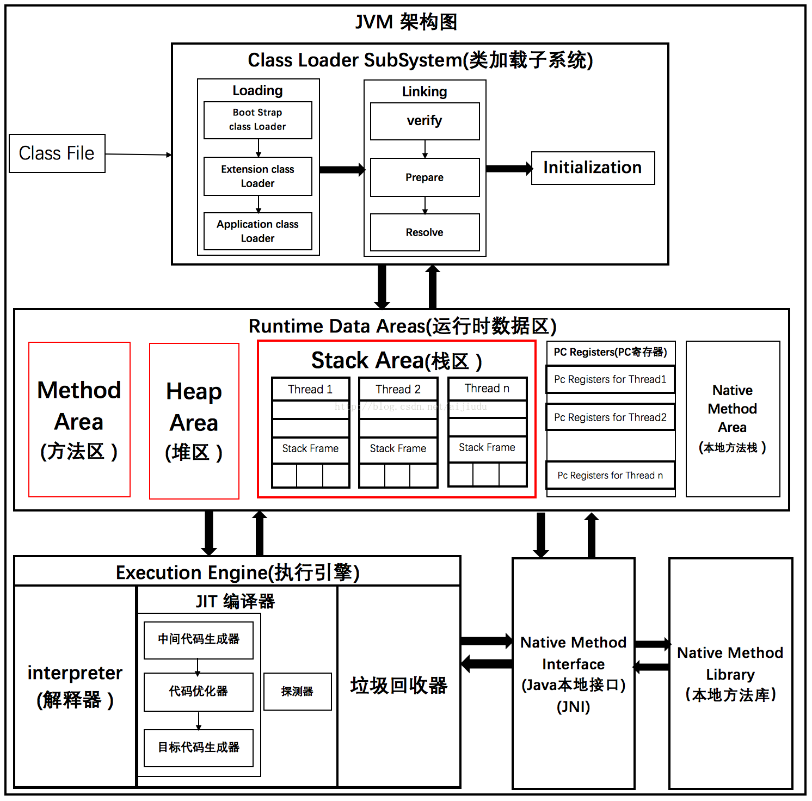

# JVM 🌟

[工具](https://render.alipay.com/p/s/jvm-generate/)

`hotspot` : `解释器`与`jit即时编译器`协同工作
`jrocket`: oracle 专注于服务端应用, 只包含即时编译器,启动慢 运行时速度快
`j9`: ibm
`harmony`: apache/ibm/intel

等等....

## 反编译

```bash
javap -v xxx.class
```

## 指令集架构

> jvm 基于栈的指令集架构, 指令集小 步骤多 跨平台 和 cpu 指令集耦合低

## 生命周期

- 启动 bootstrap class loader 创建 init class 来完成
- 执行 java 程序
- 退出 正常/异常退出

## Runtime

> 管理运行时数据区`runtime data area`

## 架构图



## classlocader

1. 加载 class 并实例化
2. link prepare 阶段 类变量初始化

## jvm 参数

- Xms 堆起始内存
- Xmx 堆最大内存
- Xmn 新生代大小
- XX:+PrintGCDetails
- XX:metspaceSize
- client/server 64 位默认 server 模式
- XX:+HeapDumpOnOutOfMemoryError oom 生成 dump 文件

  占用大小->gc 后大小->分配的大小

  `yongGC` `old` `GC fullGc`

## GC

`G1`

- 并发/并行 标记
- 分代收集
- 空间整合
- 可预测的停顿时间模型

## oom

- 年轻代

  存活时间短 eden space 满了 gc 转入老年代

- 老年代

  存活时间长 XX:NewRatio=4 新时代 1 老年代 4

- minor gc 新生代 gc

- major gc 老年代 gc 用户线程暂停 尽量避免

- full gc 用户线程暂停 system.gc() 老年代空间不足 方法区空间不足 尽量避免

- 方法区超限

## 调试

- jvisualVM

- flight recorder

- jprofiler

- gcviewer/gceasy

内存泄露检查-->堆/方法区内存参数

# 并发编程

## CountDownLatch

减法 线程外等待

## CyclicBarrier

加法 线程内部等待

## Semaphore

信号量 控制线程最大并发数量 acquire()/release()

## ReentrantLock

lock/unLock

## Condition

条件队列 await/signal 一个线程阻塞等待另一个线程的信号

## ReadWriteLock/ReetrantReadWriteLock

读写锁 readLock/writeLock

## volatile

共享变量（类的成员变量、类的静态成员变量）

- 保证了不同线程对这个变量进行操作时的可见性，即一个线程修改了某个变量的值，这新值对其他线程来说是立即可见的
- 禁止进行指令重排序

应用场景: `状态标志` `单例模式` `独立观察`

## BlockingQueue

阻塞队列 put/take

- arrayBlockingqueue 数组结构
- linkedBlockingqueue 链表结构
- linkedBlockingdeque 双向链表阻塞队列

`插入`: add(抛异常) offer(特殊值) put(阻塞) offer(超时)
`移除`: remove poll take poll(time)
`检查`: element peek 无 无

> 特殊值: 增删返回 true/false 检查返回元素/null

## ThreadPool

`ExecutorService` `Executors`

- newFixedThreadPool
- newCachedThreadPool
- newSingleThreadExecutor
- newScheduledThreadPool

`ThreadPoolExecutor`:

> 最大容纳数 maxpoolSize+queueSize

- corePoolSize
- maxPoolSize cpu 密集型:cpu 核心数 io 密集型:最大任务数-队列容量）/每个线程每秒处理能力 = 最大线程数
- keepAliveTime
- blockingQueue
- threadFactory
- rejectHandler `Abort`抛异常 `CallerRuns`回退给调用方线程处理 `Discard`丢弃 `DiscardOldest`

## ForkJoin

`ForkJoinPool` `ForkJoinTask` `RecursiveTask`

`computer`方法内 fork() 递归执行 computer 方法任务, 汇总结果 result=xx.join()

## CompleteableFuture

`异步回调`

`runAsync` : 没有返回值 `supplyAsync` : 需要返回值

`whenComplete` `exceptionaly` `get`

## 函数式编程

```java
Function<T,R>
// T:输入 R:返回
// R apply(T)
Predicate<T>

//   T:输入 返回:Boolean

//   Boolean test(T)

Consumer<T>

//   T:输入 返回:void

//   void accept(T)

Supplier<T>

//   输入:void 返回:T

//   T get()
```

## Spring 事务

隔离级别:

```
ISOLATION_DEFAULT	使用后端数据库默认的隔离级别
ISOLATION_READ_UNCOMMITTED	允许读取尚未提交的更改。可能导致脏读、幻读或不可重复读
ISOLATION_READ_COMMITTED	允许从已经提交的并发事务读取。可防止脏读，但幻读和不可重复读仍可能会发生
ISOLATION_REPEATABLE_READ	对相同字段的多次读取的结果是一致的，除非数据被当前事务本身改变。可防止脏读和不可重复读，但幻读仍可能发生
ISOLATION_SERIALIZABLE	完全服从ACID的隔离级别，确保不发生脏读、不可重复读和幻读。这在所有隔离级别中也是最慢的，因为它通常是通过完全锁定当前事务所涉及的数据表来完成的, 可以加共享锁(不排他), 一个事务不释放,其它事务只能读数据
```

传播机制:

```
PROPAGATION_MANDATORY	表示该方法必须运行在一个事务中。如果当前没有事务正在发生，将抛出一个异常
PROPAGATION_NESTED	表示如果当前正有一个事务在进行中，则该方法应当运行在一个嵌套式事务中。被嵌套的事务可以独立于封装事务进行提交或回滚。如果封装事务不存在，行为就像PROPAGATION_REQUIRES一样。
PROPAGATION_NEVER	表示当前的方法不应该在一个事务中运行。如果一个事务正在进行，则会抛出一个异常。
PROPAGATION_NOT_SUPPORTED	表示该方法不应该在一个事务中运行。如果一个现有事务正在进行中，它将在该方法的运行期间被挂起。
PROPAGATION_SUPPORTS	表示当前方法不需要事务性上下文，但是如果有一个事务已经在运行的话，它也可以在这个事务里运行。
PROPAGATION_REQUIRES_NEW	表示当前方法必须在它自己的事务里运行。一个新的事务将被启动，而且如果有一个现有事务在运行的话，则将在这个方法运行期间被挂起。
PROPAGATION_REQUIRES	表示当前方法必须在一个事务中运行。如果一个现有事务正在进行中，该方法将在那个事务中运行，否则就要开始一个新事务。
```
