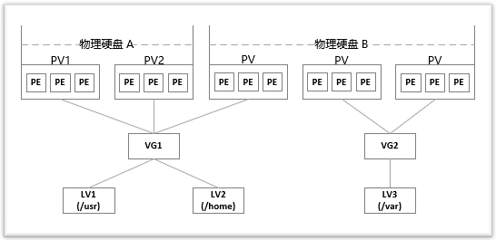

# Linux

## LVM 磁盘管理

> 物理硬盘 --> 物理卷 PV --> 卷组 VG --> 逻辑卷 LV --> 挂载



```bash
# gpt 分区
gdisk /dev/sdn

# ...
partprobe # 刷新分区表

# 创建PV卷

pvcreate /dev/sdn /dev/sdx

# 卷组

vgcreate -s 32M xxx /dev/sdn  # -s PE最小块大小  4M整数倍

# 已有vgroup 增加一块  pv
vgextend xxx  /dev/sdb

# 逻辑卷

lvcreate -L 15G -n xxxx1  xxx(vg name) # -L 容量大小

# 格式化逻辑卷

mkfs.ext4 /dev/xxx/xxxx1   # /dev目录下会存在  卷组名/逻辑卷名的路径

# 挂载 /dev/xxx/xxxx1 到具体目录上

# 自动挂载 /etc/fstab 增加
/dev/xxx/xxxx1 /data       ext4    defaults       0       0


# 扩展/缩小逻辑卷
lvextend -L +50G /dev/xxx/xxxx1   # 增加50G
lvreduce -L -50G /dev/xxx/xxxx1   # 减小50G

lvextend -r -l +100%FREE /dev/xxx/xxxx1  # 分配vg剩余所有空间  -r 刷新文件系统大小

# 更新
resize2fs /dev/xxx/xxxx1  # etx格式
xfs_growfs /dev/xxx/xxx1  # xfs格式
```

## 内核参数优化

`/etc/sysctl.conf` 内核参数

```bash
vm.swappiness=0
net.ipv4.ip_forward=1
net.ipv4.tcp_syncookies = 1
net.ipv4.tcp_tw_reuse = 1
net.ipv4.tcp_tw_recycle = 1
net.ipv4.tcp_fin_timeout = 30
net.ipv4.tcp_keepalive_time = 1200
net.ipv4.tcp_max_syn_backlog = 8192
net.ipv4.tcp_max_tw_buckets = 5000

# net.ipv4.tcp_syncookies = 1表示开启SYN Cookies。当出现SYN等待队列溢出时，启用cookies来处理，可防范少量SYN攻击，默认为0，表示关闭；

# net.ipv4.tcp_tw_reuse = 1 表示开启重用。允许将TIME-WAIT sockets重新用于新的TCP连接，默认为0，表示关闭；

# net.ipv4.tcp_tw_recycle = 1 表示开启TCP连接中TIME-WAIT sockets的快速回收，默认为0，表示关闭。

# net.ipv4.tcp_fin_timeout = 30 表示如果套接字由本端要求关闭，这个参数决定了它保持在FIN-WAIT-2状态的时间。默认是60s。

# net.ipv4.tcp_keepalive_time = 1200 表示当keepalive起用的时候，TCP发送keepalive消息的频度。缺省是2小时，改为20分钟。

# net.ipv4.ip_local_port_range = 1024 65000 表示用于向外连接的端口范围。缺省情况下很小：32768到61000，改为1024到65000。

# net.ipv4.tcp_max_syn_backlog = 8192 表示SYN队列的长度，默认为1024，加大队列长度为8192，可以容纳更多等待连接的网络连接数。

# net.ipv4.tcp_max_tw_buckets = 5000表示系统同时保持TIME_WAIT套接字的最大数量，如果超过这个数字，TIME_WAIT套接字将立刻被清除并打印警告信息。默认为180000，改为5000。

```

`/etc/security/limits.conf` 文件打开句柄限制

```bash
* soft nofile 65535
* hard nofile 65535
```

## systemctl 服务

> /usr/lib/systemd/下, 开机不登录就能启动的服务最好放在 /usr/lib/systemd/system 系统服务, .../user: 用户服务 需要用户登录才可以启动

```bash
# [Unit]、[Service]和[Install]
[Unit]   # 主要是服务说明
Description=test   # 简单描述服务
After=network.target    # 描述服务类别，表示本服务需要在network服务启动后在启动
Before=xxx.service      # 表示需要在某些服务启动之前启动，After和Before字段只涉及启动顺序，不涉及依赖关系

[Service]  # 核心区域
Type=forking     # 表示后台运行模式。
User=root        # 设置服务运行的用户
Group=root       # 设置服务运行的用户组
KillMode=control-group   # 定义systemd如何停止服务
PIDFile=/usr/local/test/test.pid    # 存放PID的绝对路径
Restart=no        # 定义服务进程退出后，systemd的重启方式，默认是不重启
ExecStart=/usr/local/test/bin/startup.sh    # 服务启动命令，命令需要绝对路径
ExecReload=/xxxxx
ExecStop=/xxxxx
PrivateTmp=true                               # 表示给服务分配独立的临时空间

[Install]
WantedBy=multi-user.target  # 多用户

#Type的类型有：
#    simple(默认）：# 以ExecStart字段启动的进程为主进程
#    forking:  # ExecStart字段以fork()方式启动，此时父进程将退出，子进程将成为主进程（后台运行）。一般都设置为forking
#    oneshot:  # 类似于simple，但只执行一次，systemd会等它执行完，才启动其他服务
#    dbus：    # 类似于simple, 但会等待D-Bus信号后启动
#    notify:   # 类似于simple, 启动结束后会发出通知信号，然后systemd再启动其他服务
#    idle：    # 类似于simple，但是要等到其他任务都执行完，才会启动该服务。
#
#EnvironmentFile:
#    指定配置文件，和连词号组合使用，可以避免配置文件不存在的异常。
#
#Environment:
#    后面接多个不同的shell变量。
#    例如：
#    Environment=DATA_DIR=/data/elk
#    Environment=LOG_DIR=/var/log/elasticsearch
#    Environment=PID_DIR=/var/run/elasticsearch
#    EnvironmentFile=-/etc/sysconfig/elasticsearch
#
#连词号（-）：在所有启动设置之前，添加的变量字段，都可以加上连词号
#    表示抑制错误，即发生错误时，不影响其他命令的执行。
#    比如`EnviromentFile=-/etc/sysconfig/xxx` 表示即使文件不存在，也不会抛异常
#
#KillMode的类型：
#    control-group(默认)：# 当前控制组里的所有子进程，都会被杀掉
#    process: # 只杀主进程
#    mixed:   # 主进程将收到SIGTERM信号，子进程收到SIGKILL信号
#    none:    # 没有进程会被杀掉，只是执行服务的stop命令
#Restart的类型：
#    no(默认值)： # 退出后无操作
#    on-success:  # 只有正常退出时（退出状态码为0）,才会重启
#    on-failure:  # 非正常退出时，重启，包括被信号终止和超时等
#    on-abnormal: # 只有被信号终止或超时，才会重启
#    on-abort:    # 只有在收到没有捕捉到的信号终止时，才会重启
#    on-watchdog: # 超时退出时，才会重启
#    always:      # 不管什么退出原因，都会重启
#    # 对于守护进程，推荐用on-failure
#RestartSec字段：
#    表示systemd重启服务之前，需要等待的秒数：RestartSec: 30
#
#各种Exec*字段：
#    # Exec* 后面接的命令，仅接受“指令 参数 参数..”格式，不能接受<>|&等特殊字符，很多bash语法也不支持。如果想支持bash语法，需要设置Tyep=oneshot
#    ExecStart：    # 启动服务时执行的命令
#    ExecReload：   # 重启服务时执行的命令
#    ExecStop：     # 停止服务时执行的命令
#    ExecStartPre： # 启动服务前执行的命令
#    ExecStartPost：# 启动服务后执行的命令
#    ExecStopPost： # 停止服务后执行的命令
#
#
#WantedBy字段：
#    multi-user.target: # 表示多用户命令行状态，这个设置很重要
#    graphical.target:  # 表示图形用户状体，它依赖于multi-user.target
```

## rsync 同步

```bash
# 远程 ----> 本地  root@xxx:/xxx  /home.....
rsync -arPu --exclude 'demo1/' --exclude 'demo2/' --exclude 'demo3/' root@202.60.245.163:/root/test /root

-v, --verbose 详细模式输出
-q, --quiet 精简输出模式
-c, --checksum 打开校验开关，强制对文件传输进行校验
-a, --archive 归档模式，表示以递归方式传输文件，并保持所有文件属性，等于-rlptgoD
-r, --recursive 对子目录以递归模式处理
-R, --relative 使用相对路径信息
-b, --backup 创建备份，也就是对于目的已经存在有同样的文件名时，将老的文件重新命名为~filename。可以使用--suffix选项来指定不同的备份文件前缀。
--backup-dir 将备份文件(如~filename)存放在在目录下。
-suffix=SUFFIX 定义备份文件前缀
-u, --update 仅仅进行更新，也就是跳过所有已经存在于DST，并且文件时间晚于要备份的文件。(不覆盖更新的文件)
-l, --links 保留软链结
-L, --copy-links 想对待常规文件一样处理软链结
--copy-unsafe-links 仅仅拷贝指向SRC路径目录树以外的链结
--safe-links 忽略指向SRC路径目录树以外的链结
-H, --hard-links 保留硬链结
-p, --perms 保持文件权限
-o, --owner 保持文件属主信息
-g, --group 保持文件属组信息
-D, --devices 保持设备文件信息
-t, --times 保持文件时间信息
-S, --sparse 对稀疏文件进行特殊处理以节省DST的空间
-n, --dry-run现实哪些文件将被传输
-W, --whole-file 拷贝文件，不进行增量检测
-x, --one-file-system 不要跨越文件系统边界
-B, --block-size=SIZE 检验算法使用的块尺寸，默认是700字节
-e, --rsh=COMMAND 指定使用rsh、ssh方式进行数据同步
--rsync-path=PATH 指定远程服务器上的rsync命令所在路径信息
-C, --cvs-exclude 使用和CVS一样的方法自动忽略文件，用来排除那些不希望传输的文件
--existing 仅仅更新那些已经存在于DST的文件，而不备份那些新创建的文件
--delete 删除那些DST中SRC没有的文件
--delete-excluded 同样删除接收端那些被该选项指定排除的文件
--delete-after 传输结束以后再删除
--ignore-errors 及时出现IO错误也进行删除
--max-delete=NUM 最多删除NUM个文件
--partial 保留那些因故没有完全传输的文件，以是加快随后的再次传输
--force 强制删除目录，即使不为空
--numeric-ids 不将数字的用户和组ID匹配为用户名和组名
--timeout=TIME IP超时时间，单位为秒
-I, --ignore-times 不跳过那些有同样的时间和长度的文件
--size-only 当决定是否要备份文件时，仅仅察看文件大小而不考虑文件时间
--modify-window=NUM 决定文件是否时间相同时使用的时间戳窗口，默认为0
-T --temp-dir=DIR 在DIR中创建临时文件
--compare-dest=DIR 同样比较DIR中的文件来决定是否需要备份
-P 等同于 --partial
--progress 显示备份过程
-z, --compress 对备份的文件在传输时进行压缩处理
--exclude=PATTERN 指定排除不需要传输的文件模式
--include=PATTERN 指定不排除而需要传输的文件模式
--exclude-from=FILE 排除FILE中指定模式的文件
--include-from=FILE 不排除FILE指定模式匹配的文件
--version 打印版本信息
--address 绑定到特定的地址
--config=FILE 指定其他的配置文件，不使用默认的rsyncd.conf文件
--port=PORT 指定其他的rsync服务端口
--blocking-io 对远程shell使用阻塞IO
-stats 给出某些文件的传输状态
--progress 在传输时现实传输过程
--log-format=formAT 指定日志文件格式
--password-file=FILE 从FILE中得到密码
--bwlimit=KBPS 限制I/O带宽，KBytes per second
-h, --help 显示帮助信息
```

## zsh

> home end 键 & 小键盘

```bash
# key bindings
bindkey "\e[1~" beginning-of-line
bindkey "\e[4~" end-of-line
bindkey "\e[5~" beginning-of-history
bindkey "\e[6~" end-of-history

# for rxvt
bindkey "\e[8~" end-of-line
bindkey "\e[7~" beginning-of-line
# for non RH/Debian xterm, can't hurt for RH/DEbian xterm
bindkey "\eOH" beginning-of-line
bindkey "\eOF" end-of-line
# for freebsd console
bindkey "\e[H" beginning-of-line
bindkey "\e[F" end-of-line
# completion in the middle of a line
bindkey '^i' expand-or-complete-prefix

# Fix numeric keypad
# 0 . Enter
bindkey -s "^[Op" "0"
bindkey -s "^[On" "."
bindkey -s "^[OM" "^M"
# 1 2 3
bindkey -s "^[Oq" "1"
bindkey -s "^[Or" "2"
bindkey -s "^[Os" "3"
# 4 5 6
bindkey -s "^[Ot" "4"
bindkey -s "^[Ou" "5"
bindkey -s "^[Ov" "6"
# 7 8 9
bindkey -s "^[Ow" "7"
bindkey -s "^[Ox" "8"
bindkey -s "^[Oy" "9"
# + - * /
bindkey -s "^[Ol" "+"
bindkey -s "^[Om" "-"
bindkey -s "^[Oj" "*"
bindkey -s "^[Oo" "/"

```

## Vim

> .vimrc

搜索高亮 <code>set hlsearch</code>

## dash

ubuntu 下 declare 报错:

```bash
sudo dpkg-reconfigure dash
# 选否  ubuntu默认sh 指向了dash  通过上边命令  解除dash与sh的关联
```

## root 用户

为`root`用户设置密码

`ubuntu`开启`root`: sshd 配置文件 `PermitRootLogin yes`

## ansible

`ansible all -m ping -v`

默认模块`command` 有些命令无法执行

执行 shell `ansible xxx -m shell -a 'ls /'`

执行 shell 脚本 `ansible xxx -m script -a ./xx.sh`

`copy`:支持目录

`fetch`:只能单文件

`file`: 操作文件 `ansible xxx -m file -a 'path=/data/xx.log state=touch group=xx owner=xx mode=777'`

`unarchive`: copy=yes/no

`archive` `hostname` `cron` `user` `setup`

### playbook

`ansible-playbook xxx.yaml [--check --list-hosts --list-tags --list-tasks --limit -v]`

- hosts

  执行任务的主机

- tasks

  任务

- variables

  变量

  定义变量:

        * `命令行参数 -e xxx=ooo`

        * 直接使用`setup`的系统信息 `gather_facts`要打开

        * 单独文件定义

        `inventory`主机清单中指定变量

        ```conf
        [xxx] # 单个指定
        192.168.100.1 xx=ooo
        192.168.100.2 xx=oop

        [xxx:vars] # 指定一组
        mm=kk

        ```

        * set_fact模块定义

            ```yaml
            set_fact:
                php_redis_package: "{{ __php_redis_package }}"
            ```

- templates

  模板, templates 目录下定义

  `xxx.j2` 文件定义变量, task 执行时自动替换

- tags

  标签

  ```yaml
  - hosts: xxx:yyyy
    remote_user: root
    gather_facts: no # 是否收集主机信息
    vars:
        - xx: oo

    tasks:
      - name: kkk
        tags: pppp  # 执行的时候指定tag执行 -t pppp
        remote_user: ooo
        module: args
        notify: handlersName # 触发handlers执行

    handlers:
      - name: {{ variables_name }  # 变量
        module: args
  ```
