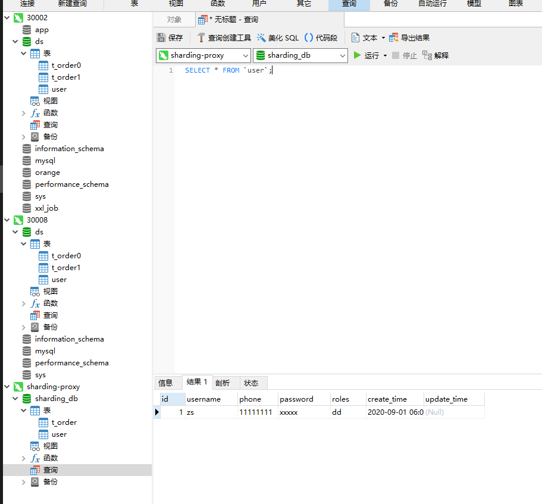

# MySQL ☢️

## 主从同步

主节点:

配置文件:

```bash
server_id=1  唯一
log-bin=mysql-log
expire_logs_days = 15
binlog-ignore-db=mysql  忽略同步
binlog-ignore-db=test

binlog-do-db=xxx  要同步的数据库

binlog_format=STATEMENT  binlog格式

gtid_mode=ON
enforce_gtid_consistency=ON
```

statement :记录写操作
row: 记录每一行数据变化
mixed: 自动选择

> 创建一个用户, 赋予 replaction slave 权限

> CHANGE MASTER TO MASTER_DELAY = 1800；单位为秒 延迟从库同步时间

> show master status;

从节点:

配置文件

```bash
server-id=2
relay-log=mysql-relay
log-bin=xxx
binlog-format=ROW

replicate-do-db=xxx  可以不指定
replicate-do-db=xxx

replicate-ignore-db=xxx

gtid_mode=ON
enforce_gtid_consistency=ON

mysql> CHANGE MASTER TO MASTER_HOST = '10.*.*.36', MASTER_USER = 'repl', MASTER_PASSWORD = 'replpassword', MASTER_PORT = 3306, MASTER_AUTO_POSITION = 1, MASTER_RETRY_COUNT = 0, MASTER_HEARTBEAT_PERIOD = 10000;

# master  用户密码 时  caching_sha2_password 策略的话  必须设置一个安全连接用户(要配置公钥私钥)

# 或者

CHANGE MASTER TO master_host='192.168.49.80', master_port= 30002, master_auto_position=1;   #需要开启gtid 并且不能与 master_log_file master_log_pos同时使用
START SLAVE USER='mmss' PASSWORD='test' DEFAULT_AUTH='mysql_native_password';


# 数据同步不一致

# 清掉slave  导入数据后  继续开启同步
```

> stop slave;

> reset master; reset slave;

> show slave status;

```bash
CHANGE MASTER TO option [, option] ... [ channel_option ]

option: {
    MASTER_BIND = 'interface_name'
  | MASTER_HOST = 'host_name'
  | MASTER_USER = 'user_name'
  | MASTER_PASSWORD = 'password'
  | MASTER_PORT = port_num
  | PRIVILEGE_CHECKS_USER = {'account' | NULL}
  | REQUIRE_ROW_FORMAT = {0|1}
  | REQUIRE_TABLE_PRIMARY_KEY_CHECK = {STREAM | ON | OFF}
  | MASTER_CONNECT_RETRY = interval
  | MASTER_RETRY_COUNT = count
  | MASTER_DELAY = interval
  | MASTER_HEARTBEAT_PERIOD = interval
  | MASTER_LOG_FILE = 'source_log_name'
  | MASTER_LOG_POS = source_log_pos
  | MASTER_AUTO_POSITION = {0|1}
  | RELAY_LOG_FILE = 'relay_log_name'
  | RELAY_LOG_POS = relay_log_pos
  | MASTER_COMPRESSION_ALGORITHMS = 'value'
  | MASTER_ZSTD_COMPRESSION_LEVEL = level
  | MASTER_SSL = {0|1}
  | MASTER_SSL_CA = 'ca_file_name'
  | MASTER_SSL_CAPATH = 'ca_directory_name'
  | MASTER_SSL_CERT = 'cert_file_name'
  | MASTER_SSL_CRL = 'crl_file_name'
  | MASTER_SSL_CRLPATH = 'crl_directory_name'
  | MASTER_SSL_KEY = 'key_file_name'
  | MASTER_SSL_CIPHER = 'cipher_list'
  | MASTER_SSL_VERIFY_SERVER_CERT = {0|1}
  | MASTER_TLS_VERSION = 'protocol_list'
  | MASTER_TLS_CIPHERSUITES = 'ciphersuite_list'
  | MASTER_PUBLIC_KEY_PATH = 'key_file_name'
  | GET_MASTER_PUBLIC_KEY = {0|1}
  | IGNORE_SERVER_IDS = (server_id_list)
}

channel_option:
    FOR CHANNEL channel

server_id_list:
    [server_id [, server_id] ... ]
```

```bash
START SLAVE [thread_types] [until_option] [connection_options] [channel_option]

thread_types:
    [thread_type [, thread_type] ... ]

thread_type:
    IO_THREAD | SQL_THREAD

until_option:
    UNTIL {   {SQL_BEFORE_GTIDS | SQL_AFTER_GTIDS} = gtid_set
          |   MASTER_LOG_FILE = 'log_name', MASTER_LOG_POS = log_pos
          |   RELAY_LOG_FILE = 'log_name', RELAY_LOG_POS = log_pos
          |   SQL_AFTER_MTS_GAPS  }

connection_options:
    [USER='user_name'] [PASSWORD='user_pass'] [DEFAULT_AUTH='plugin_name'] [PLUGIN_DIR='plugin_dir']


channel_option:
    FOR CHANNEL channel

gtid_set:
    uuid_set [, uuid_set] ...
    | ''

uuid_set:
    uuid:interval[:interval]...

uuid:
    hhhhhhhh-hhhh-hhhh-hhhh-hhhhhhhhhhhh

h:
    [0-9,A-F]

interval:
    n[-n]

    (n >= 1)
```

## MySQL 分区

1. range: 给定一个连续区间的范围值进行分区

```sql
-- 语法
create table <table> (
    // 字段
) ENGINE=MyISAM  DEFAULT CHARSET=utf8 AUTO_INCREMENT=1
partition by range (分区字段) (
  partition <分区名称> values less than (Value),
  partition <分区名称> values less than (Value),
  ...
  partition <分区名称> values less than maxvalue
);
```

2. list: 设置若干个固定值进行分区，如果某个字段的值在这个设置的值列表中就会被分配到该分区

```sql
-- 语法
create table <table> (
    // 字段
) ENGINE=数据库引擎  DEFAULT CHARSET=utf8 AUTO_INCREMENT=1
partition by LIST (分区字段或者基于该字段的返回的整数值的表达式) (
  partition <分区名称> values IN (Value1，Value2, Value3),
  ...
  partition <分区名称> values IN (Value4, Value5),
);
```

3. columns 分区: columns 分区分为 range columns 和 list columns 两种，支持整数(tinyint 到 bigint， 不支持 decimal 和 float)、日期(date、datetime)、字符串(char、varchar、binary、varbinary)三大数据类型

```sql
partition by range columns(a, b) (
   partition p01 values less than (0, 10),
   partition p02 values less than (10, 10),
   partition p03 values less than (10, 20),
   partition p04 values less than (10, 35),
   partition p05 values less than (10, maxvalue),
   partition p06 values less than (maxvalue, maxvalue),
);
```

4. hash 分区: 对分区键应用一个散列函数，以此确定数据应当放在 N 个分区中的哪个分区

```sql
-- HASH
create table <table> (
    // 字段
) ENGINE=innodb  DEFAULT CHARSET=utf8 AUTO_INCREMENT=1
PARTITION BY HASH(expr)
PARTITIONS <num>;
```

5. key 分区: key 分区不允许使用用于自定义的表达式，需要使用 mysql 服务器提供的 hash 函数，同时 hash 分区只支持整数分区，而 key 分区支持使用 blob or text 类型外的其他类型的列作为分区键

```sql
partition by key(expr) partitions num;

-- 不指定默认首选主键作为分区键，在没有主键的情况下会选择非空唯一键作为分区键
partition by key() partitions num;

-- linear key
partition by linear key(expr)
```

## PXC 同步

pecona 只支持 innodb 引擎 数据强一致性 实时同步数据

pxc 集群启动时 要从最后一个退出的节点启动, 最后退出的节点会被标记为主节点, `grastate.dat` 文件 safe_to_bootstrap=1 表示这个节点是最后退出的节点, 要作为主节点启动 文件位置在 mysql data 目录

> pxc集群注意节点间 ssl 同步

主节点容器: (旧版本 新版本看文档)

```bash
docker run -d -p xxx:3306 \
-e MYSQL_ROOT_PASSWORD=root \
-e CLUSTER_NAME=master \
-e XTRABACKUP_PASSWORD=root \
-v xxx:/var/lib/mysql --privileged \
--name=node1 --net=xxxx pxc
```

从节点容器:

```bash
docker run -d -p xxx:3306 -e MYSQL_PASSWORD=root \
-e CLUSTER_NAME=master \
-e XTARBACKUP_PASSWORD=root \
-e CLUSTER_JOIN=node1 \
-v xxx:/var/lib/mysql --privileged \
--name=node2 --net=xxx pxc
```

数据分片, 数据切分到不同的 pxc 集群上

## MyCat

> 听说 2.0 用 yml?

`server.xml`
配置 mycat 虚拟用户与数据库, 可以配置多个

pxc 只需要负载均衡 replication 需要读写分离

```xml
<mycat:server>
  <user name="admin" defaultAccount="true">
    <property name="password">admin</property>
    <property name="schemas">mycat</property>
  </user>
</mycat:server>
```

`schema.xml`

```xml
<dataHost name="mycat" maxCon="2000" minCon="100"
balance="0" writeType="1" dbType="mysql" dbDriver="native"
switchType="1" slaveThreshold="100">
  <heartbeat>select 1</heartbeat>
  <!--节点-->
  <writeHost host="xx" url="xxx:3306" user="root" password="root">
    <!--readHost balance需要为3-->
  </writeHost>
</dataHost>
```

`dataNode` 指定 mycat 使用的数据库

`schema` 指定虚拟库, `table` 指定切分的表

`rule.xml`

分片规则

## Percona

### XtraBackup

## ShardingSphere

1. 数据分片

> 配置对照 sharding-jdbc 看 , 官方文档写的和屎一样

> sql 语句兼容性差,一些特殊字段 需要特别注意

```yaml
schemaName: sharding_db

dataSources:
  ds0:
    url: jdbc:mysql://localhost:30002/ds
    username: root
    password: root
    connectionTimeoutMilliseconds: 30000
    idleTimeoutMilliseconds: 60000
    maxLifetimeMilliseconds: 1800000
    maxPoolSize: 65
  ds1:
    url: jdbc:mysql://localhost:30008/ds
    username: root
    password: root
    connectionTimeoutMilliseconds: 30000
    idleTimeoutMilliseconds: 60000
    maxLifetimeMilliseconds: 1800000
    maxPoolSize: 65

shardingRule:
  tables:
    t_order:
      actualDataNodes: ds${0..1}.t_order${0..1}
      databaseStrategy:
        inline:
          shardingColumn: user_id
          algorithmExpression: ds${user_id % 2}
      tableStrategy:
        inline:
          shardingColumn: order_id
          algorithmExpression: t_order${order_id % 2}
      keyGenerator: # 可以不配置
        type: SNOWFLAKE
        column: order_id
    t_order_item:
      actualDataNodes: ds${0..1}.t_order_item${0..1}
      databaseStrategy:
        inline:
          shardingColumn: user_id
          algorithmExpression: ds${user_id % 2}
      tableStrategy:
        inline:
          shardingColumn: order_id
          algorithmExpression: t_order_item${order_id % 2}
      keyGenerator:
        type: SNOWFLAKE
        column: order_item_id
  bindingTables:
    - t_order,t_order_item
  defaultDataSourceName: ds0 #  默认数据源 不分片  只能指定一个  没有指定其它规则的表都写到这一个节点
  broadcastTables: #  广播表    所有节点都会同步写入   查询的时候从一个节点查
    - user
  defaultTableStrategy:
    none:
```



## 配置

> 查看 mysql 文档, 区分 命令行配置 系统变量 配置文件...., 可配置项不完全相同

> 验证配置: mysqld --validate-config

```bash
[mysqld]
pid-file	= /var/run/mysqld/mysqld.pid
socket		= /var/run/mysqld/mysqld.sock
datadir		= /var/lib/mysql

symbolic-links=0

log-bin=mysql-log

expire_logs_days = 15 # 废弃
binlog_expire_logs_seconds=2592000  # 秒  默认30d

binlog_format=ROW  #binlog格式

gtid_mode=ON
enforce_gtid_consistency=ON

character_set_server=utf8mb4
collation_server=utf8mb4_0900_ai_ci
max_connections=1000
default-time-zone='+8:00'
slow_query_log=ON
long_query_time=10  # 默认10s
max_allowed_packet=256M
innodb_log_file_size=2GB

[client]
default-character-set=utf8mb4

```

## 函数

### 系统函数

`truncate` 截断

字符串函数 `concat` `trim` `find_in_set` `nullif`

时间日期 `datediff` `timediff` `date_format` `time_format` `date_add(now(),interval 1 day)` `makedate(year,n)`

流程控制 `if(expr,v1,v2)` `ifnull(v1,v2)` `case when expr then v1 else v2 end`

聚合函数 `sum` `avg` `count` `max` `min`

`with rollup` : `group by` 后追加一条记录, 对所有数据聚合统计

`having`子句: 聚合统计中过滤数据

### 自定义函数

## 存储过程

```bash
CREATE DEFINER=`root`@`localhost` PROCEDURE `test`()
BEGIN
	SELECT * from student;

END
```

调用:

> call test();

- 变量

  > DECLARE x, y INT DEFAULT 0; <code>声明</code>
  > SET x=10; <code>赋值</code>
  > select ... INTO y from....; <code>赋值</code>

- 参数
  > <code>IN OUT INOUT</code>

1. <code>IN</code>

```bash
CREATE PROCEDURE xxx(IN zz VARCHAR(255))
调用的时候: call xxx("测试")
```

2. <code>OUT</code>

```bash
CREATE PROCEDURE xxx(
 IN x VARCHAR(25),
 OUT y INT)
 调用: call xxx("测试",@oo);
 select @oo;  //@... 局部变量
```

- 流程控制

1.  <code>IF</code>

```bash
IF expression THEN
   statements;
END IF;
```

2.  <code>CASE</code>

```bash
CASE  case_expression
   WHEN when_expression_1 THEN commands
   WHEN when_expression_2 THEN commands
   ...
   ELSE commands
END CASE;
```

3.  <code>while</code>

```bash
WHILE expression DO
   statements
END WHILE
```

4.  <code>repeat</code>

```bash
REPEAT
 statements;
UNTIL expression
END REPEAT
```

5.  <code>loop</code>
    > leave :跳出循环
    > iterate: 继续下一次循环,类似 continue

```bash
xxx: LOOP
...
end xxx;
```

- <code>游标</code>
  > 声明: DECLARE cursor_name CURSOR FOR SELECT_statement;
  > OPEN 语句初始化游标的结果集: open cursor_name;
  > FETCH 检索游标下一行: FETCH cursor_name INTO variables;
  > DECLARE CONTINUE HANDLER FOR NOT FOUND SET finished = 1; //游标结束
  > 完整声明:

```bash
DECLARE finished INTEGER DEFAULT 0;
DECLARE email varchar(255) DEFAULT "";

DEClARE email_cursor CURSOR FOR SELECT email FROM employees;

DECLARE CONTINUE HANDLER FOR NOT FOUND SET finished = 1;
```

遍历游标:

```bash
OPEN email_cursor;
get_email: LOOP
FETCH email_cursor INTO v_email;
IF finished = 1 THEN
LEAVE get_email;
END IF;
SET email_list = CONCAT(v_email,";",email_list);
END LOOP get_email;

CLOSE email_cursor;
```

- 异常处理

1. <code>signal/resignal</code>
   > 相当于直接抛出 sql 异常

```bash
IF(C != 1) THEN
 SIGNAL SQLSTATE '45000' //只能使用sqlstate的值
 SET MESSAGE_TEXT = '......'; //只能是MESSAGE_TEXT，MYSQL_ERRORNO，CURSOR_NAME
 END IF;
```

2. <code>handler</code>

```bash
DECLARE handler_action HANDLER
    FOR condition_value [, condition_value] ...
    statement

handler_action:
    | CONTINUE
    | EXIT

condition_value:
    mysql_error_code
    | SQLSTATE [VALUE] sqlstate_value
    | condition_name
    | SQLWARNING
    | NOT FOUND
    | SQLEXCEPTION
```

### 存储函数

```bash
CREATE FUNCTION function_name(param1,param2,…)
    RETURNS datatype
   [NOT] DETERMINISTIC
 statements
```

> 必须有 returns, 仅返回一个值

### 触发器

```bash
CREATE TRIGGER trigger_name trigger_time trigger_event ON tb_name FOR EACH ROW trigger_stmt
trigger_name：触发器的名称
tirgger_time：触发时机，为BEFORE或者AFTER
trigger_event：触发事件，为INSERT、DELETE或者UPDATE
tb_name：表示建立触发器的表明，就是在哪张表上建立触发器
trigger_stmt：触发器的程序体，可以是一条SQL语句或者是用BEGIN和END包含的多条语句
所以可以说MySQL创建以下六种触发器：
BEFORE INSERT,BEFORE DELETE,BEFORE UPDATE
AFTER INSERT,AFTER DELETE,AFTER UPDATE
```

### event 事件处理

> mysql 默认关闭了事件执行, 配合文件里记得开启 event_scheduler = 1 #或者 ON

```bash
CREATE
    [DEFINER = { user | CURRENT_USER }]
    EVENT
    [IF NOT EXISTS]
    event_name
    ON SCHEDULE schedule
    [ON COMPLETION [NOT] PRESERVE]
    [ENABLE | DISABLE | DISABLE ON SLAVE]
    [COMMENT 'comment']
    DO event_body;

schedule:
    AT timestamp [+ INTERVAL interval] ...
  | EVERY interval
    [STARTS timestamp [+ INTERVAL interval] ...]
    [ENDS timestamp [+ INTERVAL interval] ...]

interval:
    quantity {YEAR | QUARTER | MONTH | DAY | HOUR | MINUTE |
              WEEK | SECOND | YEAR_MONTH | DAY_HOUR | DAY_MINUTE |
              DAY_SECOND | HOUR_MINUTE | HOUR_SECOND | MINUTE_SECOND}
```

### mysql 定时备份,邮件

> mysqldump -uroot -pxxx -RE --databases xxx > dd.sql
> -RE: 导出存储过程和 event

邮件发送配置:
sendmail: 要启动服务

/etc/mail.rc

```bash
set from=yourname@your-domain.com
set smtp=mail.your-domain.com
set smtp-auth-user=yourname
set smtp-auth-password=yourpasswd
set smtp-auth=login
```

mutt /etc/Muttrc:

```bash
set use_from=yes
set realname="data"
set from=data@darkstone.cc
set envelope_from=yes
```

> mutt xxx@cc.com -s "标题" -a 附件

> 有问题: mail 命令发送小文件可以, 大文件不能当附件. mutt 没成功过
> echo "正文内容"|mail -s "标题" -a 附件 xx@cc.com
