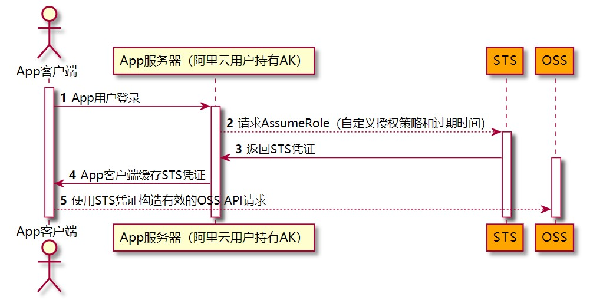

# STS

## sts 临时身份验证

### 案例 🦷

> 客户端使用 STS 临时凭证访问云服务

sts 全称 `security token service`, 目前主流的云服务平台基本都支持, 下文主要以阿里云为案例讲解, aws 大同小异, 可以类比参考. sts 可以使客户端不暴露 accessKey 与 accessSecret 实现对云服务的直接安全请求调用, 减少与后端接口的交互与额外的流量消耗.

::: tip
服务端生成 sts 临时 token 与 signature, 客户端直接基于 `sts token`、`signature` 签名等必要的参数信息实现 OSS 文件上传.
:::

使用 STS 授权用户直接访问 OSS 的流程如下： (图片来源 阿里云文档)



1. 创建用于 sts 认证的`子用户`, 复制下`子用户的 AccessKey ID 与 AccessKey Secret`

2. 新建 `Ram` 角色, 分配 `AliyunSTSAssumeRoleAccess` 的系统策略权限, 同时新增权限策略, 添加对应云服务的策略, 以 oss 为例:

   具体策略配置方式查看文档, 或者通过生成器生成.

```json
{
  "Version": "1",
  "Statement": [
    {
      "Effect": "Allow",
      "Action": ["oss:PutObject", "oss:GetObject"],
      "Resource": ["acs:oss:*:*:xx-bucket/oo", "acs:oss:*:*:xx-bucket/oo/*"]
    }
  ]
}
```

3. 复制下 `Ram` 角色的 `ARN` 字段值, 也可以修改`最大会话时间`.

4. 账号相关权限分配结束, 下面开始写服务端代码, 生成 `sts token`、signature `、`policy` 等信息.

接口调用也可以用 `OpenAPI Explorer` 调试请求

以 java 代码为例(基于旧 sdk):

```java
// STS接入地址，例如sts.cn-hangzhou.aliyuncs.com。
String regionId = "";
// 填写步骤1生成的访问密钥AccessKey ID和AccessKey Secret。
String accessKeyId = "xxxxxxxxxx";
String accessKeySecret = "ooooooooooo";
String endPoint = ".....";  // oss bucket endpoint
// 填写步骤3获取的角色ARN。
String roleArn = appConfig.getAliArn();
// 自定义角色会话名称，用来区分不同的令牌，例如可填写为SessionTest。
String roleSessionName = "xxTest";

String path = "oo"; // oss bucket 内文件子路径
Long maxFileSize = 10 _ 1024 _ 1024L; // 最大 10M
// 1 小时有效
OffsetDateTime expires = LocalDateTime.now().plusHours(1L).atOffset(ZoneOffset.of("+8"));
​
try {
    // sts token
    ​
    // 构造 profile。
    IClientProfile profile = DefaultProfile.getProfile(regionId, accessKeyId, accessKeySecret);
    // 构造 client。
    DefaultAcsClient client = new DefaultAcsClient(profile);
    final AssumeRoleRequest request = new AssumeRoleRequest();
    request.setRoleArn(roleArn);
    request.setRoleSessionName(roleSessionName);
    request.setDurationSeconds(3600L); // 设置临时访问凭证的有效时间为 3600 秒。
    ​
    AssumeRoleResponse response = client.getAcsResponse(request);
    AssumeRoleResponse.Credentials credentials = response.getCredentials();
    String stsToken = credentials.getSecurityToken();
    ​
    // 签名
    OSS ossClient = new OSSClientBuilder().build(endPoint, credentials.getAccessKeyId(), credentials.getAccessKeySecret(), stsToken);
    ​
    // policy 策略, 进一步限定权限
    // 临时访问凭证最后获得的权限是步骤 4 设置的角色权限和该 Policy 设置权限的交集，
    PolicyConditions policyConditions = new PolicyConditions();
    policyConditions.addConditionItem(PolicyConditions.COND_CONTENT_LENGTH_RANGE, 0, maxFileSize);
    ​
    String policy = ossClient.generatePostPolicy(Date.from(expires.toInstant()), policyConditions);
    String signature = ossClient.calculatePostSignature(policy);
    ​
    log.info("endpoint: {},policy: {},signature: {}, path: {}, accessKeyId: {}, sts_token: {}",endPoint, Base64Utils.encodeToString(policy.getByte(StandardCharsets.UTF_8)),
    signature, path, credentials.getAccessKeyId(), stsToken);)
} catch (ClientException e) {
    log.error("获取 sts token 失败", e);
}
```

::: warning
注意: 生成客户端参数 `signature` 时, 基于的是生成 `sts` 时返回的`临时 AccessKeyId` 和`临时的 AccessKeySecret`, 包括最后客户端发起 http 请求使用的也是与 sts 对应返回的`临时 AccessKeyId`, 而不是一开始创建的`子用户 id`.
:::

权限方面, 一定是 `Ram` 角色权限、`policy`、`bucket` 权限的最小交集. 注意不要搞的太复杂啰嗦把自己带沟里.

5. 客户端(web、app、小程序、postman 等等)拿到 sts token、signature、policy、临时的 accessKeyId 等信息就可以直接发起 post 请求向 oss 上传文件了.

```bash
url: bucket endpoint

请求方式: post/form-data

参数:
key: 上传后的文件路径+文件名
policy: policy json 字符串(base64)
OSSAccessKeyId: 临时的 accessKeyId
signature: 基于临时 accessKeyId accessKeySecret 计算的签名
x-oss-security-token: sts token
file: 要上传的文件
```

总结: 基于 sts 客户端文件上传 oss, 节省了服务端的带宽流量, 安全可靠, 不止 oss 服务, 绝大多数云服务也都可以基于 sts 的方式请求, 具体可以结合项目情况灵活选择.
